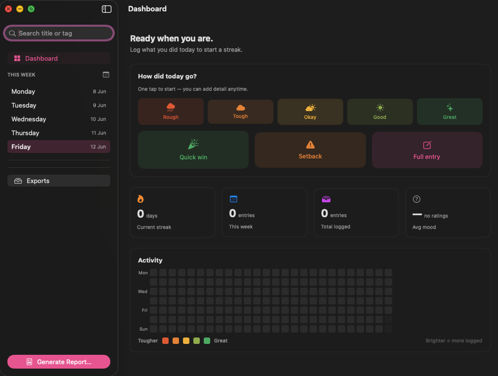

# Stacktrace

> Show progress, not hours.

A small, motivational macOS app for logging what you did each day — what you
worked on, how it went, what went well, what didn't — and exporting a clean PDF
report for any period (defaults to the current week).

Not a time tracker. It's a daily work journal that's quick to fill in and turns
your entries into a manager-ready report.



## Features

- **Daily entries** — title, description, what went well, what to improve, tags, and a one-tap mood (Rough → Great).
- **Quick wins & setbacks** — log a one-liner without the full form.
- **Dashboard** — current streak, weekly/total stats, average mood, and a GitHub-style contribution graph coloured by how each day went (orange → green) with streak milestones.
- **Tags** — reusable tag catalogue; search entries by title or tag.
- **PDF export** — grouped-by-day report for any date range, with an optional custom file name. All exports live in one place inside the app.
- **AI polish (optional)** — clean up an entry's wording with your own OpenAI API key.
- **Daily reminder (optional)** — a local notification nudging you to log your day.
- **Local-first** — everything is stored in a plain JSON file on your Mac. Nothing leaves your machine (except AI requests, if you enable them).

## Requirements

- macOS 14 (Sonoma) or later
- [Xcode 15](https://apps.apple.com/app/xcode/id497799835) or later (to build the app)

## Install & run

### Option 1 — Open in Xcode (recommended)

```bash
git clone https://github.com/wpoortman/stacktrace.git
cd stacktrace
open Stacktrace.xcodeproj
```

In Xcode:

1. Select the **Stacktrace** scheme (top toolbar).
2. If you see a signing error, open the **Stacktrace** target → **Signing & Capabilities** and either pick your Apple ID team or set **Signing Certificate** to *Sign to Run Locally*.
3. Press **Run** (⌘R). The app launches.

### Option 2 — Build a standalone .app from the command line

```bash
git clone https://github.com/wpoortman/stacktrace.git
cd stacktrace
xcodebuild -project Stacktrace.xcodeproj -scheme Stacktrace \
  -configuration Release -derivedDataPath build build
```

The built app is at:

```
build/Build/Products/Release/Stacktrace.app
```

Drag it into `/Applications` to keep it.

> First launch from Finder may show a Gatekeeper warning because the build is
> not notarized. Right-click the app → **Open** → **Open** to allow it.

## Optional setup

- **AI enhancement** — open **Settings** (⌘,) → **AI**, paste an OpenAI API key from [platform.openai.com](https://platform.openai.com/api-keys), and click *Verify*. This is separate from a ChatGPT subscription and billed per use (fractions of a cent per enhance).
- **Daily reminder** — **Settings** → **Reminders**: enable and pick a time. macOS will ask for notification permission.
- **Visible weekdays** — **Settings** → **Days**: choose which weekdays show in the sidebar.

## Your data

Entries are stored as JSON at:

```
~/Library/Application Support/Stacktrace/data.json
```

A `data.json.bak` backup is written on every save. Exported PDFs live in
`~/Library/Application Support/Stacktrace/Exports/` (open them from the app's
**Exports** view). Back up or move these files freely — deleting them is the
only way to lose data.

## Developing

The Xcode project is generated from `project.yml` with
[XcodeGen](https://github.com/yonaskolb/XcodeGen). If you change the file layout or
build settings, regenerate it:

```bash
brew install xcodegen
xcodegen generate
```

Source lives in the `Stacktrace/` directory.

## License

[GNU GPLv3](LICENSE)
